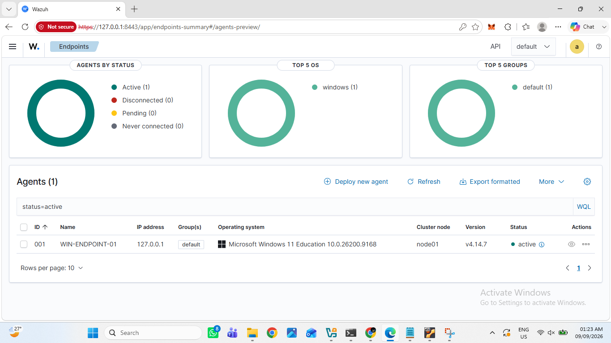
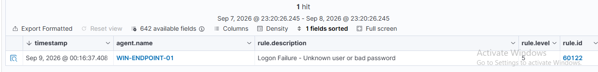
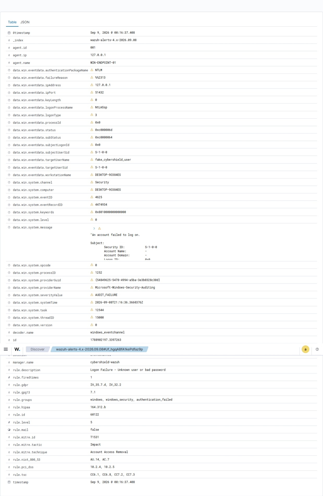

# Lab 01 — Windows Failed Authentication Detection

## Objective

The objective of this lab was to generate a controlled Windows authentication failure, collect the corresponding Windows Security event using the Wazuh agent, detect the activity through Wazuh SIEM, and investigate the resulting alert.

This lab demonstrates the basic SOC workflow:

```text
Event Generation
      ↓
Log Collection
      ↓
Detection
      ↓
SIEM Alert
      ↓
Investigation
      ↓
Analyst Assessment

```
## Lab Environment

| Component | Configuration |
|---|---|
| SIEM | Wazuh 4.14.x |
| Wazuh Server | Ubuntu Server 24.04 LTS |
| Endpoint | Windows 11 |
| Endpoint Name | WIN-ENDPOINT-01 |
| Virtualization | Oracle VirtualBox |
| Log Source | Windows Security Event Log |

## Detection

A controlled failed network authentication attempt was generated using the nonexistent account:

`fake_cybershield_user`

Windows recorded the activity as **Event ID 4625 — An account failed to log on**.

The Wazuh agent collected the event and Wazuh generated the following alert:

- **Rule ID:** 60122
- **Rule Description:** Logon Failure - Unknown user or bad password
- **Rule Level:** 5

## Investigation

The alert contained the following key information:

| Field | Observed Value |
|---|---|
| Windows Event ID | 4625 |
| Target User | fake_cybershield_user |
| Logon Type | 3 |
| Authentication Package | NTLM |
| Source IP | 127.0.0.1 |
| Status | 0xC000006D |
| SubStatus | 0xC0000064 |
| Wazuh Rule ID | 60122 |

### Analysis

Logon Type `3` represents a network authentication attempt.

The source address `127.0.0.1` is the IPv4 loopback address, showing that the authentication attempt originated from the local endpoint.

The SubStatus `0xC0000064` indicates that the specified username does not exist, which was consistent with the controlled test account.

## Analyst Assessment

The alert was generated by an intentionally created authentication failure inside the CyberShield lab.

A single failed authentication attempt is not sufficient on its own to classify activity as malicious.

Factors that would increase concern include:

- repeated failed authentication attempts
- unusual source IP addresses
- privileged accounts being targeted
- a successful login following repeated failures
- attempts involving multiple usernames

**Assessment:** Expected lab activity  
**Severity:** Low  
**Compromise Identified:** No

## Lessons Learned

This lab demonstrated that SIEM alerts must be investigated in context rather than automatically classified as incidents.

Important fields for authentication investigations include:

- target account
- source IP
- logon type
- authentication method
- failure reason
- event frequency

It also demonstrated the complete path from Windows telemetry collection to centralized Wazuh investigation.

## Screenshots

### Wazuh Agent Connected



### Failed Authentication Alert



### Event Details



## Conclusion

Lab 01 successfully demonstrated the detection and investigation of a Windows failed authentication event using Wazuh SIEM.

Windows generated Event ID 4625, the Wazuh agent collected the event, and Wazuh Rule 60122 generated an alert for investigation.

The next lab will expand this scenario by analyzing repeated authentication failures and potential brute-force behavior.
