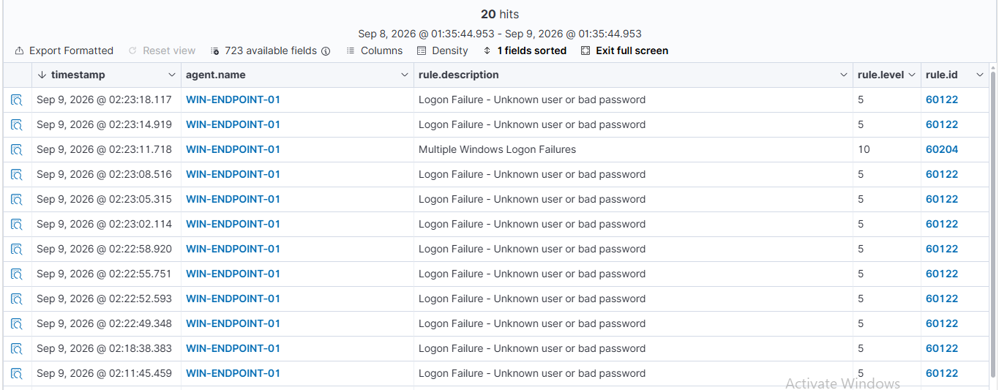
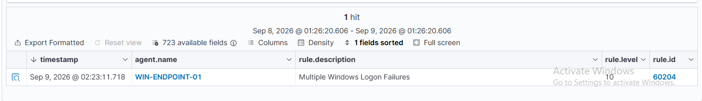
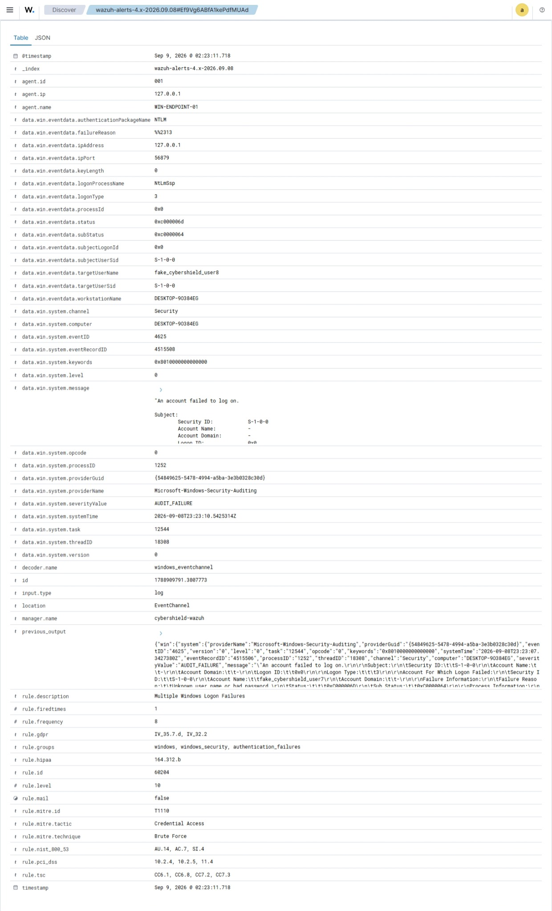

# Lab 02 — Brute-Force Detection Using Wazuh Correlation

## Objective

The objective of this lab was to generate multiple failed Windows authentication attempts within a short time period and determine whether Wazuh could correlate the events into a higher-severity brute-force alert.

This lab extends Lab 01 by moving from individual event detection to SIEM correlation.

## Lab Environment

| Component | Configuration |
|---|---|
| SIEM | Wazuh 4.14.x |
| Wazuh Server | Ubuntu Server 24.04 LTS |
| Endpoint | Windows 11 |
| Endpoint Name | WIN-ENDPOINT-01 |
| Virtualization | Oracle VirtualBox |
| Authentication Protocol | NTLM |
| Log Source | Windows Security Event Log |

## Detection

Multiple controlled failed authentication attempts were generated using nonexistent test accounts such as:

`fake_cybershield_user1`

`fake_cybershield_user2`

`fake_cybershield_user3`

The authentication attempts originated from the local endpoint using:

`127.0.0.1`

Each failed authentication generated:

- **Windows Event ID:** 4625
- **Wazuh Rule ID:** 60122
- **Rule Description:** Logon Failure - Unknown user or bad password
- **Rule Level:** 5

After multiple failures occurred within a short time period, Wazuh correlated the events and generated:

- **Rule ID:** 60204
- **Rule Description:** Multiple Windows Logon Failures
- **Rule Level:** 10
- **MITRE ATT&CK ID:** T1110
- **MITRE Technique:** Brute Force
- **MITRE Tactic:** Credential Access

## Correlation Logic

The Wazuh rule configuration was reviewed directly on the Wazuh server.

Rule `60204` was configured with:

- **Frequency:** 8
- **Timeframe:** 240 seconds
- **Correlation Field:** Source IP address
- **Rule Level:** 10

This means Wazuh generates the correlated alert when the required number of authentication failures from the same source IP occurs within the configured time window.

## Investigation

The correlated alert contained the following key information:

| Field | Observed Value |
|---|---|
| Agent | WIN-ENDPOINT-01 |
| Windows Event ID | 4625 |
| Source IP | 127.0.0.1 |
| Logon Type | 3 |
| Authentication Package | NTLM |
| Example Target User | fake_cybershield_user8 |
| Wazuh Rule ID | 60204 |
| Rule Level | 10 |
| Rule Frequency | 8 |
| MITRE ATT&CK ID | T1110 |
| MITRE Technique | Brute Force |
| MITRE Tactic | Credential Access |

### Analysis

Logon Type `3` represents a network authentication attempt.

The source address `127.0.0.1` is the IPv4 loopback address, meaning the activity originated from the local endpoint.

Unlike Lab 01, which investigated one failed authentication event, this lab demonstrated how Wazuh can identify a suspicious pattern by correlating multiple authentication failures.

The alert severity increased from Rule Level `5` for individual authentication failures to Rule Level `10` for the correlated event.

## Analyst Assessment

The detected activity matched behavior associated with repeated credential-access attempts.

Multiple authentication failures within a short period may indicate:

- brute-force attacks
- password guessing
- password spraying
- automated authentication attempts
- misconfigured software repeatedly using invalid credentials

In this case, the activity was intentionally generated inside the CyberShield lab.

**Assessment:** Expected simulated brute-force activity  
**Severity:** Medium/High for investigation  
**Compromise Identified:** No  
**MITRE ATT&CK:** T1110 — Brute Force

## Lessons Learned

This lab demonstrated the importance of event correlation in SIEM systems.

A single authentication failure may be normal user behavior, but multiple related failures within a short time period can indicate suspicious activity.

Important concepts demonstrated in this lab include:

- Windows Event ID 4625 monitoring
- Wazuh frequency-based correlation
- SIEM alert escalation
- authentication pattern analysis
- MITRE ATT&CK mapping
- Rule Level escalation from 5 to 10
- identifying suspicious behavior across multiple events

## Screenshots

### Multiple Authentication Failures

### Correlated Wazuh Alert

### Correlation Event Details

## Conclusion

Lab 02 successfully demonstrated Wazuh's ability to correlate repeated Windows authentication failures into a higher-severity security alert.

Multiple Windows Event ID 4625 events from the same source IP triggered Wazuh Rule 60204.

The resulting Level 10 alert was mapped to MITRE ATT&CK T1110 — Brute Force under the Credential Access tactic.

This lab demonstrated how SIEM correlation can identify suspicious behavior that may not be obvious when individual events are reviewed separately.
